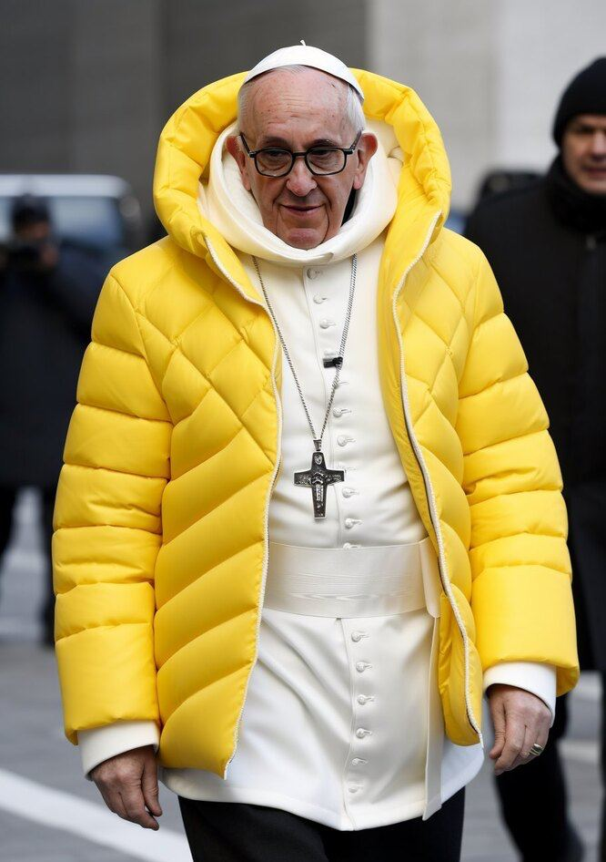

# For Fake's Sake: a set of models for detecting generated and synthetic images

Many people on the internet have recently been tricked by fake images of Pope Francis wearing a coat or of Donald Trump's arrest. 
To help combat this issue, we provide detectors for such images generated by popular tools like Midjourney and Stable Diffusion.

|  |  |  |
|-------------------------|-------------------------|--------------------------|

## Model Details

### Model Description

- **Developed by:** [Sumsub AI team](https://sumsub.com/)
- **Model type:** Image classification
- **License:** CC-By-SA-3.0
- **Types:** *midjourney_5m*(Size: 5M parameters, Description: Designed to detect photos created using various versions of Midjourney)
- **Finetuned from model:** *tf_mobilenetv3_large_100.in1k*

## Demo

The demo page can be found [here](https://huggingface.co/spaces/Sumsub/Sumsub-ffs-demo).

## How to Get Started with the Model & Model Sources

Use the code below to get started with the model:

```bash
git lfs install
git clone https://huggingface.co/Sumsub/Sumsub-ffs-synthetic-1.0_mj_5 sumsub_synthetic_mj_5
```

```python
from sumsub_synthetic_mj_5.pipeline import PreTrainedPipeline
from PIL import Image

pipe = PreTrainedPipeline("sumsub_synthetic_mj_5/")

img = Image.open("sumsub_synthetic_mj_5/images/2.jpg")

result = pipe(img)
print(result) #[{'label': 'by AI', 'score': 0.201515331864357}, {'label': 'by human', 'score': 0.7984846234321594}]
```

You may need these prerequsites installed:

```bash
pip install -r requirements.txt
pip install "git+https://github.com/rwightman/pytorch-image-models"
pip install "git+https://github.com/huggingface/huggingface_hub"
```

## Training Details

### Training Data

The models were trained on the following datasets:

**Midjourney datasets:**

- *Real photos* : [MS COCO](https://cocodataset.org/#home).
- *AI photos* : a curated dataset of images from Pinterest boards dedicated to Generative AI ([Midjourney](href='https://pin.it/13UkjgM),[Midjourney AI Art](https://pin.it/6pNXlz3), [Midjourney - Community Showcase](https://pin.it/7gi4jmT), [Midjourney](https://pin.it/4FW0LXQ), [MIDJOURNEY](https://pin.it/5mSsiPg), [Midjourney](https://pin.it/2Qx92QW)).

### Training Procedure

To improve the performance metrics, we used data augmentations such as rotation, crop, Mixup and CutMix. Each model was trained for 30 epochs using early stopping with batch size equal to 32.

## Evaluation

For evaluation we used the following datasets:

**Midjourney datasets:**

- [Kaggle Midjourney 2022-250k](https://www.kaggle.com/datasets/ldmtwo/midjourney-250k-csv): set of 250k images generated by Midjourney.
- [Kaggle Midjourney v5.1](https://www.kaggle.com/datasets/iraklip/modjourney-v51-cleaned-data): set of 400k images generated by Midjourney version 5.1.

**Realistic images:**

- [MS COCO](https://cocodataset.org/#home): set of 120k real world images.

## Metrics

<!-- These are the evaluation metrics being used, ideally with a description of why. -->

| Model           | Dataset                                                                                                       | Accuracy |
|-----------------|---------------------------------------------------------------------------------------------------------------|----------|
| midjourney_5M   | [Kaggle Midjourney 2022-250k](https://www.kaggle.com/datasets/ldmtwo/midjourney-250k-csv)                     | 0.852    |
| midjourney_5M   | [Kaggle Midjourney v5.1](https://www.kaggle.com/datasets/iraklip/modjourney-v51-cleaned-data)                 | 0.875    |
| midjourney_5M   | [MS COCO](https://cocodataset.org/#home)                                                                      | 0.822    |

## Limitations

- It should be noted that achieving 100% accuracy is not possible. Therefore, the model output should only be used as an indication that an image may have been (but not definitely) artificially generated.
- Our models may face challenges in accurately predicting the class for real-world examples that are extremely vibrant and of exceptionally high quality. In such cases, the richness of colors and fine details may lead to misclassifications due to the complexity of the input. This could potentially cause the model to focus on visual aspects that are not necessarily indicative of the true class.


## Citation

If you find this useful, please cite as:

```text
@misc{sumsubaiornot, 
    publisher = {Sumsub},
    url       = {https://huggingface.co/Sumsub/Sumsub-ffs-synthetic-1.0_mj_5},
    year      = {2023},
    author    = {Savelyev, Alexander and Toropov, Alexey and Goldman-Kalaydin, Pavel and Samarin, Alexey},
    title     = {For Fake's Sake: a set of models for detecting deepfakes, generated images and synthetic images}
}
```

## References

- Stöckl, Andreas. (2022). Evaluating a Synthetic Image Dataset Generated with Stable Diffusion. 10.48550/arXiv.2211.01777.
- Lin, Tsung-Yi & Maire, Michael & Belongie, Serge & Hays, James & Perona, Pietro & Ramanan, Deva & Dollár, Piotr & Zitnick, C.. (2014). Microsoft COCO: Common Objects in Context.
- Howard, Andrew & Zhu, Menglong & Chen, Bo & Kalenichenko, Dmitry & Wang, Weijun & Weyand, Tobias & Andreetto, Marco & Adam, Hartwig. (2017). MobileNets: Efficient Convolutional Neural Networks for Mobile Vision Applications.
- Liu, Zhuang & Mao, Hanzi & Wu, Chao-Yuan & Feichtenhofer, Christoph & Darrell, Trevor & Xie, Saining. (2022). A ConvNet for the 2020s.
- Wang, Zijie & Montoya, Evan & Munechika, David & Yang, Haoyang & Hoover, Benjamin & Chau, Polo. (2022). DiffusionDB: A Large-scale Prompt Gallery Dataset for Text-to-Image Generative Models. 10.48550/arXiv.2210.14896.